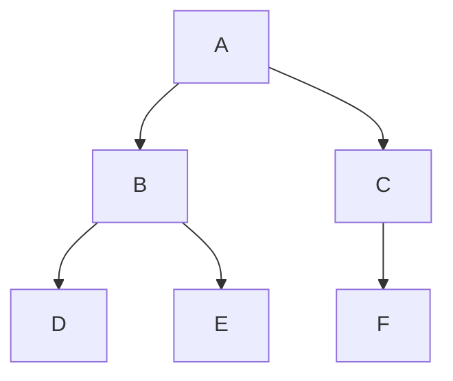

# 混合整数計画問題に対する分枝限定法

本記事では, 以下の混合整数計画問題 $(P_0)$

> $$
> \begin{aligned}
> \min \ \boldsymbol{z} &= \boldsymbol{c}^{t}\boldsymbol{x} + \boldsymbol{d}^t\boldsymbol{y}\\
> \text{s.t.} \ \ &A\boldsymbol{x} + B\boldsymbol{y} = \boldsymbol{b},\\
> &\boldsymbol{\ell}^{0} \leq \boldsymbol{y} \leq \boldsymbol{u}^{0},\\
> &\boldsymbol{x} \in (\mathbb{R}_{\geq 0})^{n_1}\\
> &\boldsymbol{y} \in \mathbb{Z}^{n_2}
> \end{aligned}
> $$

を考える. ただし, 
$$
\begin{aligned}
    &\boldsymbol{c} \in \mathbb{R}^{n_1}, \
    \boldsymbol{d},\  \boldsymbol{y}\in \mathbb{R}^{n_2},\ \boldsymbol{b} \in \mathbb{R}^{m},\\
    &\boldsymbol{\ell}^{0},\ \boldsymbol{u}^{0} \in \mathbb{Z}^{n_2},\
    \\
    &A \in M_{m \times n_1}(\mathbb{R}),\
    B \in M_{m \times n_2}(\mathbb{R})
\end{aligned}
$$
とする. また, ベクトル間の不等式は各成分での不等式をまとめて表す. すなわち, $\boldsymbol{x} = (x_1, \dots, x_n), \boldsymbol{y} = (y_1, \dots, y_n) \in \mathbb{R}^{n}$ に対して 
$$
    \boldsymbol{x} \leq \boldsymbol{y} 
    \iff \begin{cases}
        x_1 \leq y_1,\\
        \dots,\\
        x_n \leq y_n.
    \end{cases}
$$

## 分枝操作

混合整数問題 $(P_0)$ の緩和問題 $(C_0)$ 

> $$
> \begin{aligned}
> \min \ \boldsymbol{z} &= \boldsymbol{c}^{t}\boldsymbol{x} + \boldsymbol{d}^t\boldsymbol{y}\\
> \text{s.t.} \ \ &A\boldsymbol{x} + B\boldsymbol{y} = \boldsymbol{b},\\
> &\boldsymbol{\ell}^{0} \leq \boldsymbol{y} \leq \boldsymbol{u}^{0},\\
> &\boldsymbol{x} \in (\mathbb{R}_{\geq 0})^{n_1}\\
> &\boldsymbol{y} \in \textcolor{red}{(\mathbb{R}_{\geq 0})^{n_2}}
> \end{aligned}
> $$

を考えると, これは線形計画問題.
ここでは, 緩和問題 $(C_0)$ の実行可能領域が有界であると仮定する. 
このとき, $(C_0)$ は必ず最適解 $(\overline{\boldsymbol{x}}^0, \overline{\boldsymbol{y}}^0)$ 及びそれに対応する最適解 $\overline{\boldsymbol{z}}^0$ を持つ.

$\overline{\boldsymbol{y}}^0 \in \mathbb{Z}^{n_2}$ なら, $(\overline{\boldsymbol{x}}^0, \overline{\boldsymbol{y}}^0)$ はもとの問題 $(P_0)$ の最適解でもあるため終了. そうでない, すなわち $\overline{\boldsymbol{y}}^0$ のある成分 $\overline{y}_{i}^0$ が整数でない場合, $(P_0)$ を2つの子問題 $(P_1)$ 

> $$
> \begin{aligned}
> \min \ \boldsymbol{z} &= \boldsymbol{c}^{t}\boldsymbol{x} + \boldsymbol{d}^t\boldsymbol{y}\\
> \text{s.t.} \ \ &A\boldsymbol{x} + B\boldsymbol{y} = \boldsymbol{b},\\
> &\boldsymbol{\ell}^{0} \leq \boldsymbol{y} \leq \textcolor{red}{(u^0_1, \dots, u^0_{i-1}, [\overline{y}^0_i], u_{i+1}^0,\dots,u^0_{n_2})^t},\\
> &\boldsymbol{x} \in (\mathbb{R}_{\geq 0})^{n_1}\\
> &\boldsymbol{y} \in \mathbb{Z}^{n_2}
> \end{aligned}
> $$

及び子問題 $(P_2)$

> $$
> \begin{aligned}
> \min \ \boldsymbol{z} &= \boldsymbol{c}^{t}\boldsymbol{x} + \boldsymbol{d}^t\boldsymbol{y}\\
> \text{s.t.} \ \ &A\boldsymbol{x} + B\boldsymbol{y} = \boldsymbol{b},\\
> &\textcolor{red}{(\ell^0_1, \dots, \ell^0_{i-1}, [\overline{y}^0_i]+1, \ell_{i+1}^0,\dots,\ell^0_{n_2})^t} \leq \boldsymbol{y} \leq  \boldsymbol{u}^0,\\
> &\boldsymbol{x} \in (\mathbb{R}_{\geq 0})^{n_1}\\
> &\boldsymbol{y} \in \mathbb{Z}^{n_2}
> \end{aligned}
> $$

に分割する. ここで, $\alpha \in \mathbb{R}$ に対して, ガウス記号 $[\alpha]$ は $[\alpha] \leq \alpha < [\alpha] + 1$ を満たす整数とする. 
$y_i \in \mathbb{Z}$ に注意すると
$$
\ell^0_{i} \leq y_i \leq u^0_i \iff \ell^0_{i} \leq y_i \leq [\overline{y}^0_i] \ \ \text{または} \ \ [\overline{y}^0_i]+1 \leq y_i \leq u^0_i
$$
だから,
$$
(\text{$(P_0)$ の実行可能領域}) = (\text{$(P_1)$ の実行可能領域}) \sqcup (\text{$(P_2)$ の実行可能領域})
$$
であり, 
$$
(\text{$(P_0)$ の最適値}) = \min\left\{(\text{$(P_1)$ の最適値}), (\text{$(P_2)$ の最適値})\right\}
$$
である.




```
-----------|-----|--●--|-----|---------------
           0     1  j  2     3
```


<!-- 以下脚注 -->
<!-- [^1]: 連続変数のみを残すと線形計画問題となり, 単体法や内点法などある程度大規模な問題に対しても求解可能なアルゴリズムが利用できる.
[^2]: 本来, ここは $\min$ ではなく $\inf$ とするべきところだが, 簡単のため $\min$ を考える.  -->